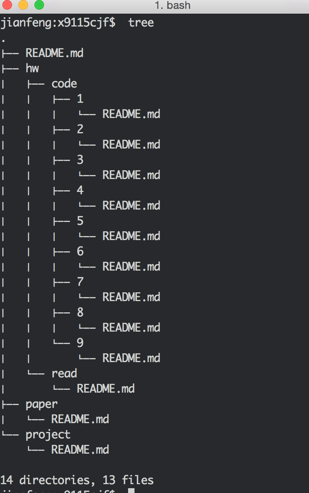

# Code1: coding homework
### Jianfeng Chen

1. Repo directory tree
   

2. Python, pip and easy_install
   
   
   

3. IDE. I use the emacs
   

4. okok test result. Note that the "python okok.py" was rerunned automatically after I save the okok.py
   