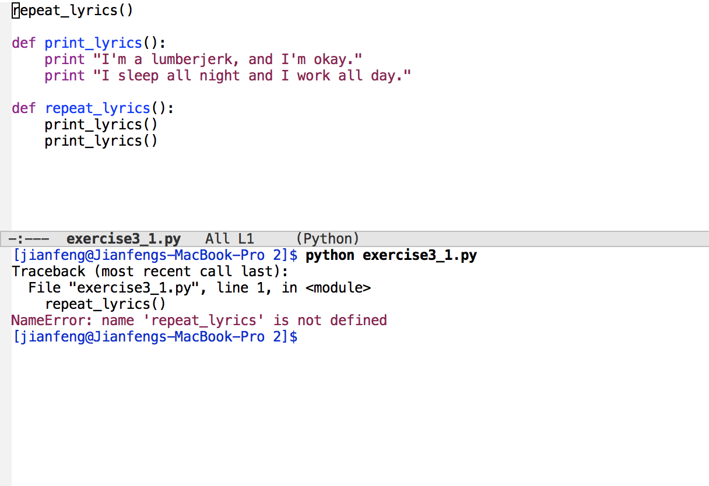
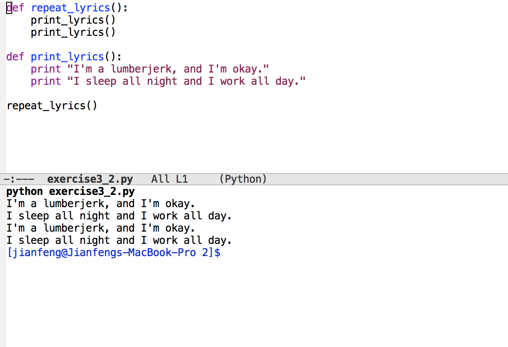
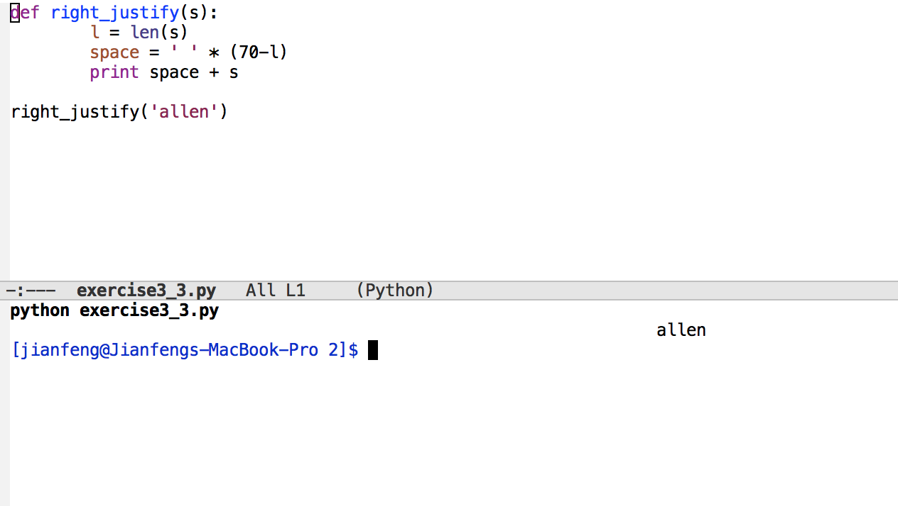
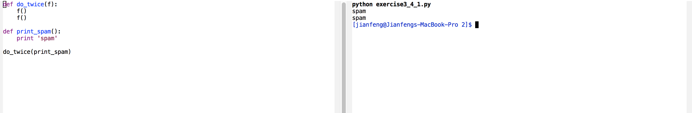
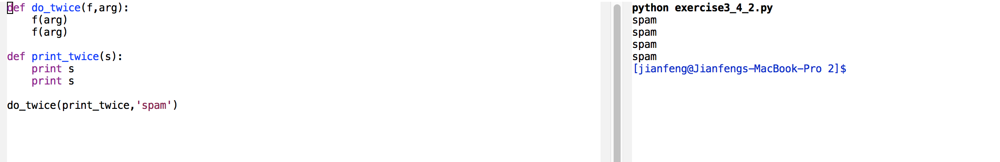
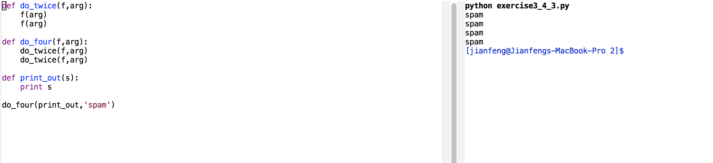
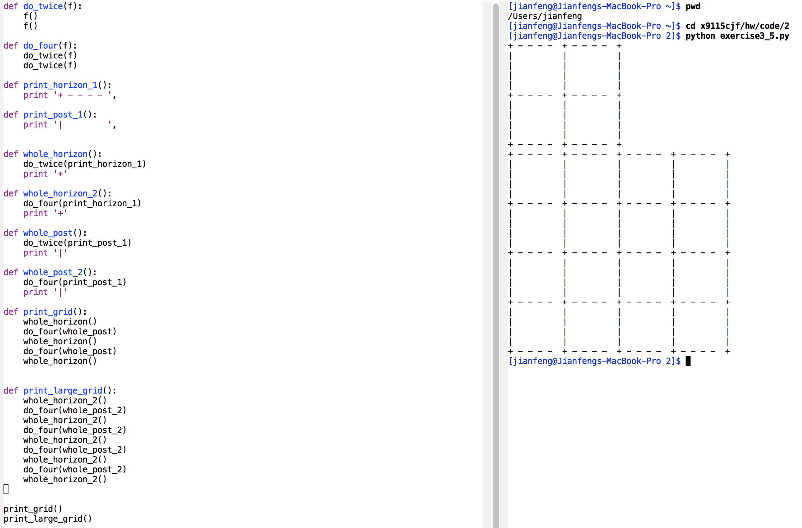

# Coding homework 2

## Exercise for chapter 3

See the source code at think3.py The screenshots are shown as follows.

### Exercise 3.1

### Exercise 3.2

### Exercise 3.3

### Exercise 3.4

### Exercise 3.5

