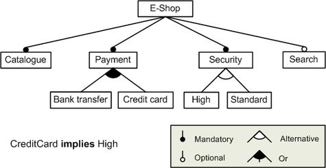
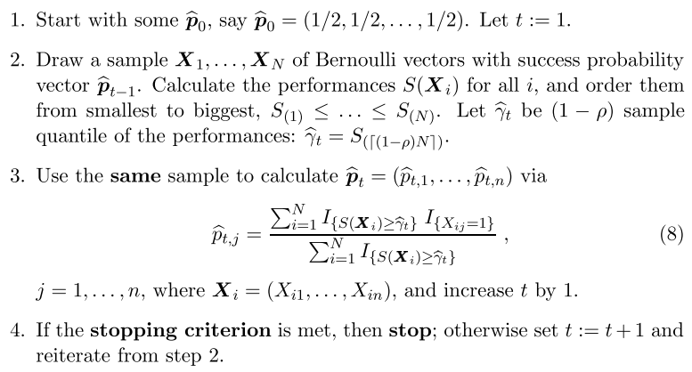
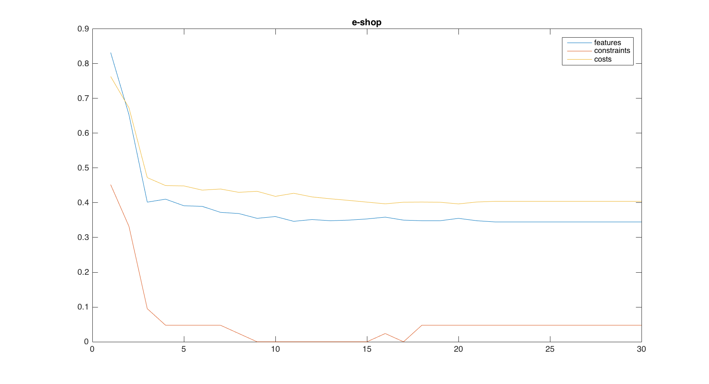
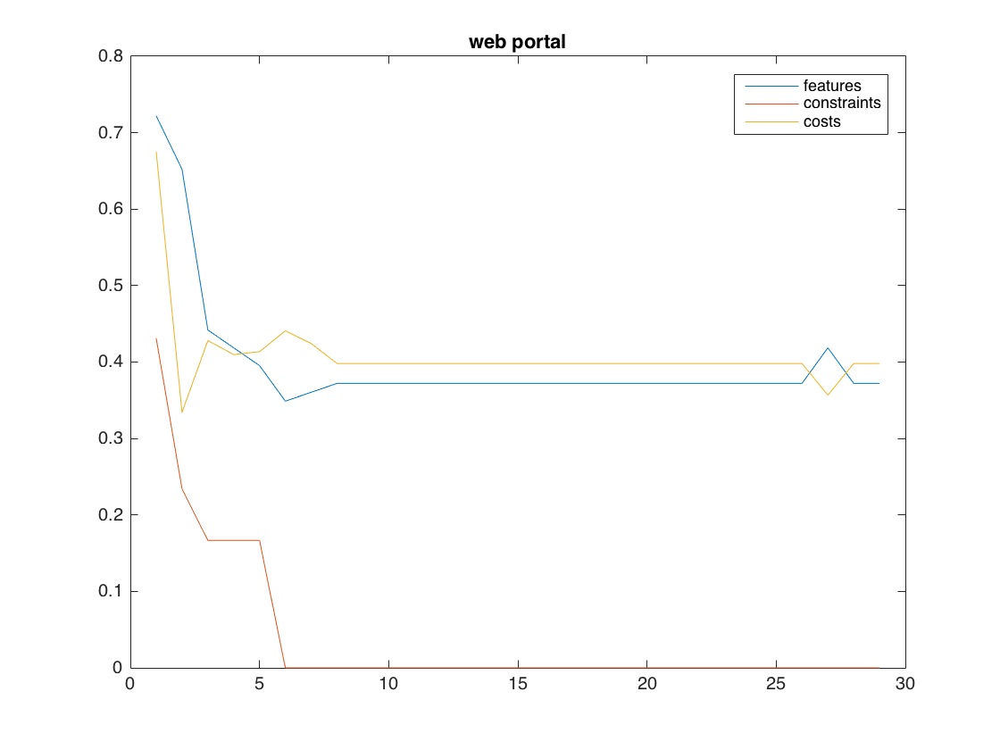
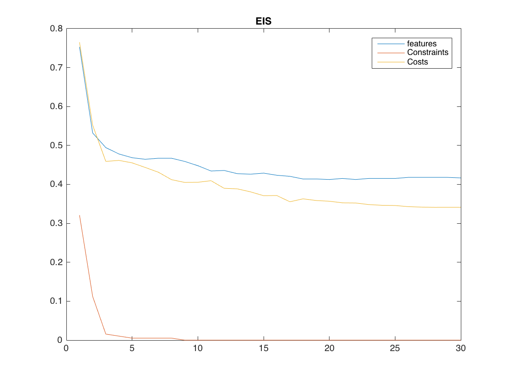
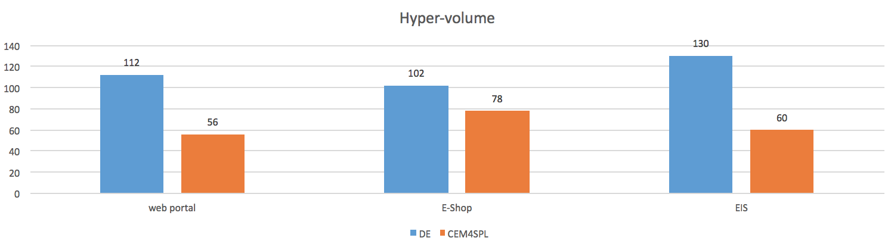
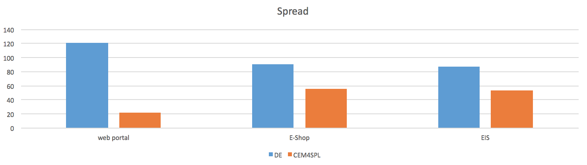

# CEM4SPL: Cross-entropy method for Software Product Line Modeling
#### Jianfeng Chen (jchen37@ncsu.edu)

## Abstract
Modern softwares are becoming larger and larger. Some commercial software platforms are required to equip with hundreds, even thousands of features, such as enable security network, enable scalable database, customizable GUI, etc. Software product line (SPL) feature selection involves the optimization of multiple objectives in a large and highly constrained search space. This problem has been proved as a NP-hard problem. In this project, I create an algorithm-CEM4SPL to solve this problem basing on the cross entropy method (CEM). Results showed that cross entropy method can do optimization within the complex space.

## 1. Introduction
In product line engineering, a software feature is the unit of functionality that satisfies a requirement, represents a design decision and provides a potential configuration option. Currently, software product has becoming more and more complex, one software product might contain hundreds, even thousands of software features. Among these features, some of them are related to each other, such as feature A might be exclusive to feature B, or feature X requires feature Y. These features can be organized as a feature tree.

To get various product, we can optimize the feature tree. Many researchers have been focusing on the such software product line optimization problem. In this project, I would like to apply the cross-entropy method to SPL problem. To the best of my knowledge, no one have tried this method in this area. Results showed that the cross-entropy method can do optimization in this SPL problem, but it is not the state-of-the-art in this area.

The main contribution to this project includes:
1) Give the convenient parser for the Software project line datbase repo- SPLOT.org.
2) Extend the cross-entropy to multi-objective version by the Pareto ranking algorithm.
3) Compare the CEM4SPL with the Differential evolution algorithm, which is another population algorithm to handle this problem.

The rest of this report organized as follows: section 2 gave a brief introduction to the simple cross-entropy method as well as the feature tree model; section 3 introduce the CEM4SPL model; section 4 were the experiment results and section 5 were the conclusion drew from the experiment results; section 6 listed the threats to validity in this project and the last section were the future works.

All sourcecode for this project has been published at https://goo.gl/hCCel6

## 2. Background
In this section, I first introduce the software product tree; then introduce some important terms in cross-entropy method.
### Feature teee
See the following example,  


In this model, E-shop can be divided into 4 sub-feature points: catalogue, payment, security and search. Among them, search is optional, and others are mandatory. In payment sub-feature, it can be bank transfer, credit card or both of them. Security can be high or standard.  

If the above are all problem statement, this problem is quit simple, I can pick up the features from root to leaves. But in this example, their is one cross-tree constraint: CreditCard implies High security.  

Due to the cross-tree constraints, the problem become much more complex. As I all know, SAT is a NP-hard problem. Essentially, the cross-tree constraints in this problem can be expressed as SAT.

So ultimately this is a optimization problem, specifically, a binary variable optimization problem. The objectives are: try to find out as much features as possible, and follow as much constraints as possible.

In abstract, the feature model can be translated into a optimization problem: let the leaves feature be arguments, get the total satisfied feature and satisfied constraint as two objectives. Our goal is to find the settings for leaves feature (which are binary variables) so that two objectives can be optimized.

Also, in the software project, develop cost, precedentness and defects are very important factors which should not be ignored. Consequently, adding these three objective into the problem can make this tool more powerful. How to define the "best" solution and how to solve this problem will be discussed in the latter section.

To summary, this project accepts a feature model, as will as some attributes of features, and returns which feature should be implemented.

### Cross-entropy method
Here I would like to introduce the cross-entropy method(CEM) briefly. More details can be found at [Rubinstein and Kroese(2004)] and the official website for this method (http://www.cemethod.org).

Let X=(x1,x2,...,xn) be a random vector from some space X^n.  
f is some real function on space X^n.  
The main task for CEM is to find the optimization point x* that minimize/maximize f.  
The algorithm for CEM are listed as follows.  


## 3. CEM4SPL
### Feature tree xml parser
SPLOT(splot-research.org) has a open feature model repository. All models in this project are fetched from this repository. In the SPLOT repository, feature models are expressed in SXFM language. To parse it, I create a python script with the help of regular expression. Like this,  
```python
import re
import xml.etree.ElementTree as ET

def load_ft_url(url):
    # load the feature tree and constraints
    tree = ET.parse(url)
    root = tree.getroot()

    for child in root:
        if child.tag == 'feature_tree':
            feature_tree = child.text
        if child.tag == 'constraints':
            constraints = child.text

    # initialize the feature tree
    ft = FeatureTree()

    # parse the feature tree text
    feas = feature_tree.split("\n")
    feas = filter(bool, feas)
    common_feature_pattern = re.compile('(\t*):([romg]?).*\W(\w+)\W.*')
    group_pattern = re.compile('\t*:g \W(\w+)\W \W(\d),([\d\*])\W.*')
```
After parsing the SPLOT XML file, the feature model is transferred into a tree structure. By this feature tree, objectives can be easily get and validation can be finish fast too.

### Applying the CEM
As is introduced in the last section, cross-entropy method provides us a simple way to optimize one-dimension objective function. However, we know that the software product line is usually multi-objective function. Here comes a problem, how to apply the cross-entropy to such a multi-objective problems?

NSGA-II inspired me a lot. The most difficult part in transferring one-dimension to multi-dimension optimization problem in CEM is the Step 2 in the upper chart. We have to sort the objectives among the sample vectors. For the one dimension problem, the sorting is trivial. However, for the multi-objective, what should we do? In NSGA-II algorithm, there is a operation called non-dominated-sort. One version (slow version) of non-dominated sort is shown as follows.
```python
 N = len(WORK)
    for i in range(N):
        for j in range(i+1,N):
            if dominate(WORK[j][n:n+m], WORK[i][n:n+m]):
                WORK[i][n+m] += 1
```
Where dominate(A,B) is the binary-domination.

We don't need to apply the continuous domination in this project, because we just need the ranking for the samples, and all selected samples (elites) are treated equally in the cross-entropy method.

By merging the NSGA-II non-dominated sorting into CEM, we can build the model to solve the SPL optimization problem.

### Some extra discussion
1. Bernoulli distribution? Normal distribution? At this project I choose the Bernoulli distribution. Since, a) Bernoulli distribution is easy- only one parameter; b) all the decisions are sperately, as long as the distribution is maintained the same all the time, the result should be converge and effective. There might be some other distribution which can fasten the converge process, this is one of the future work in this project.
2. Should fill the initial population (sample vectors) with valid ones (no constraint violates)? The answer is no. Results show that the constraint violation rate will reduce and converge at the rate of zero in many models. Consequently, to increase the variety of the population, no need to fill the initial population with valid ones.
3. Too many evaluations? Yes, this is one of drawbacks for the cross-entropy. This project is just a try for applying this method for the software product line. To reduce the number of evaluation, Joseph Krall et al. raised the GALE model, which can reduce the number of evaluation effectively.

## 4. Experiment Results
This model was tested by the E-Shop, Web portal and EIS model. The basic information is listed as follows.
| model      | Features | Leaves | Constraints |
|------------|----------|--------|-------------|
| web portal | 43       | 28     | 6           |
| E-Shop     | 290      | 194    | 21          |
| EIS        | 366      | 344    | 192         |

Here is the median of different objectives at each generation. Please note that all the objectives are "less is more". The sampling size was 1000, elite rate is 0.1, max-generation is 30[we will see that CEM4SPL model converge extremely fast!].  
  
  


To compare the results with differential evolution, I apply the same initial population with two algorithms. Due to the time limitation, I use the existed implement of differential evolution algorithm. Source code for this can be accessed at https://goo.gl/odiVwK. Here are the comparison results at the converge (I did not set up stopping criteria at the CEM4SPL. As we can see, it converges so quickly).

  



## 5. Conclusion
From the results at section 4, we can draw a conclusion that:
1. The CEM4SPL can converge at tens of generations. As a comparison, the Differential evolution did not converge at such rate.
2. For the hypervolume and spread, DE outperforms CEM4SPL

So, is CEM4SPL a good model? At this time, not yet. However, the CEM4SPL can get feature-rich valid population very quickly. The result for CEM4SPL can be applied to other algorithms as the initial population. Also, to the best of my knowledge, nobody apply the cross-entropy method in this area, this is an first-step attempt for CEM.

## 6. Threats to Validity
1. Only three software product model were tested in this project. All of them were manually set up. More large, real model is needed. Such as some commercial projects, Linux models, etc.
2. Due to the time limitation, the differential evolution algorithm was fetched from other source. The validity for DE is not proved.
3. Does the first sampling matter for the final results? Should we use the valid features in the first step? This has been proved by the experiment.


## 7. Future Work
As was discussed in section 3, some other sampling distribution in CEM should be tested in the future.

Will this model work for extremely huge model, such as the Linux model? I did not test this in this project. In the future, I should apply the CEM4SPL for the huge model.


## Reference
[1] Storn, Rainer, and Kenneth Price. "Differential evolution–a simple and efficient heuristic for global optimization over continuous spaces." Journal of global optimization 11.4 (1997): 341-359. 

[2] Abbass, Hussein A., Ruhul Sarker, and Charles Newton. "PDE: a Pareto-frontier differential evolution approach for multi-objective optimization problems." Evolutionary Computation, 2001. Proceedings of the 2001 Congress on. Vol. 2. IEEE, 2001.  

[3] Robič, Tea, and Bogdan Filipič. "DEMO: Differential evolution for multiobjective optimization." Evolutionary Multi-Criterion Optimization. Springer Berlin Heidelberg, 2005.

[4] Deb, Kalyanmoy, et al. "Scalable multi-objective optimization test problems." Proceedings of the Congress on Evolutionary Computation (CEC-2002),(Honolulu, USA). Proceedings of the Congress on Evolutionary Computation (CEC-2002),(Honolulu, USA), 2002. 

[5] Pampara, Gary, Andries Petrus Engelbrecht, and Nelis Franken. "Binary differential evolution." Evolutionary Computation, 2006. CEC 2006. IEEE Congress on. IEEE, 2006.  

[6] Zitzler, Eckart, and Lothar Thiele. "Multiobjective evolutionary algorithms: a comparative case study and the strength Pareto approach." evolutionary computation, IEEE transactions on 3.4 (1999): 257-271.  

[7] Zitzler, Eckart, and Simon Künzli. "Indicator-based selection in multiobjective search." Parallel Problem Solving from Nature-PPSN VIII. Springer Berlin Heidelberg, 2004.  

[8] Sayyad, Abdel Salam, Tim Menzies, and Hany Ammar. "On the value of user preferences in search-based software engineering: A case study in software product lines." Software engineering (ICSE), 2013 35th international conference on. IEEE, 2013.  

[9] Deb, Kalyanmoy, et al. "A fast and elitist multiobjective genetic algorithm: NSGA-II." Evolutionary Computation, IEEE Transactions on 6.2 (2002): 182-197.  

[10] Sayyad, Abdel Salam, et al. "Scalable product line configuration: A straw to break the camel's back." Automated Software Engineering (ASE), 2013 IEEE/ACM 28th International Conference on. IEEE, 2013.

[11] Bekker, James, and Chris Aldrich. "The cross-entropy method in multi-objective optimisation: An assessment." European Journal of Operational Research 211.1 (2011): 112-121.

[12] Deb, Kalyanmoy, et al. "A fast and elitist multiobjective genetic algorithm: NSGA-II." Evolutionary Computation, IEEE Transactions on 6.2 (2002): 182-197.
